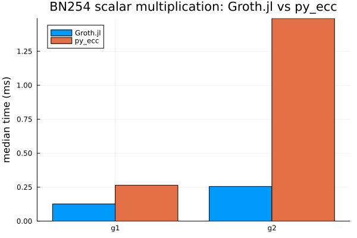
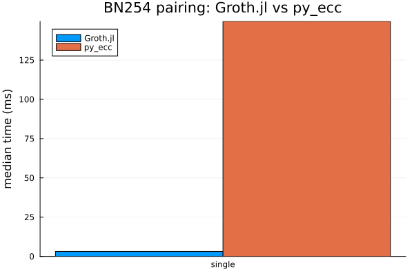
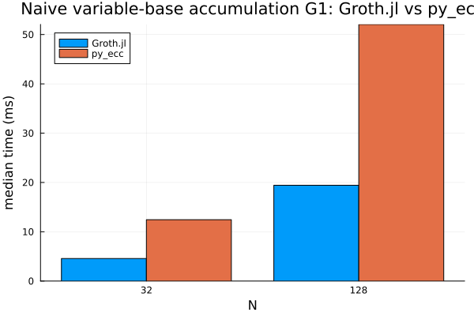
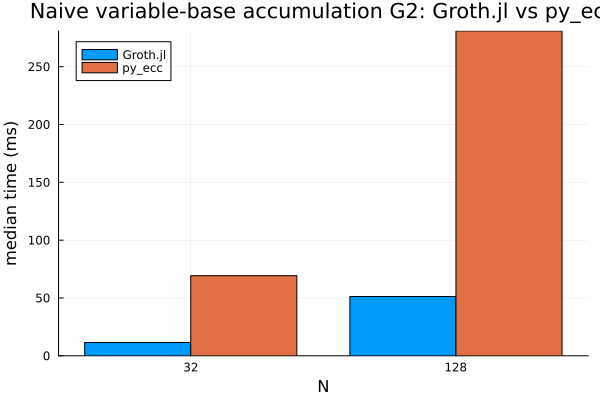

# Groth.jl

Groth.jl is a Julia research platform for **BN254 algebra, pairings, and
Groth16**.

The project has two explicit roles: it is a learning bridge from RareSkills /
`zk-book` concepts to inspectable Julia code, and it is a performance-oriented
implementation whose hot paths no longer always look like the simplest
textbook derivations.

It combines:

- inspectable finite-field, extension-field, curve, and pairing code
- an end-to-end Groth16 setup / prove / verify pipeline
- benchmark and profiling infrastructure for prover hot paths
- Pluto-first educational material alongside performance-oriented engineering

This repository is **research-grade, not production software**. The goals are
clarity, mathematical correctness, REPL ergonomics, and serious performance
work without hiding the underlying algebra.

## What Is Implemented

- **GrothAlgebra**
  - BN254 `Fq` / `Fr` on a fixed-width Montgomery backend
  - generic polynomial utilities, cached evaluation domains, FFT / inverse FFT
  - variable-base MSM, fixed-base tables, and scalar-multiplication helpers
- **GrothCurves**
  - BN254 `Fp2` / `Fp6` / `Fp12`
  - G1 / G2 Jacobian arithmetic and batch normalization
  - optimal ate pairing with Miller loop and final exponentiation
- **GrothProofs**
  - R1CS and QAP conversion
  - Groth16 setup, proving, verification, and prepared-verifier flow
  - deterministic benchmark fixtures for `prove_full`
- **Benchmarks and docs**
  - reproducible JSON/PNG benchmark artifacts
  - primitive comparisons against `py_ecc` and local arkworks harnesses
  - roadmap and implementation notes tied to measured performance work

## Current Status

The project has moved well beyond a minimal Groth16 demo.

- BN254 primitives no longer run on the original `BigInt` hot path; the main
  backend is now Montgomery-based.
- Primitive benchmarks currently beat `py_ecc` across the tracked BN254 suite.
- The gap to arkworks has narrowed substantially, but arkworks is still ahead.
- QAP conversion now follows the arkworks domain shape: constraints first,
  public-input selector rows next, and zero padding to the next power of two.
- The QAP-domain-aligned larger deterministic `prove_full` baseline after
  alignment, coset-only H proving, and H/L MSM fusion is `26.643 ms` in the
  tracked summary
  [docs/src/assets/prove_full_msm_tuning_2026_05_11.json](./docs/src/assets/prove_full_msm_tuning_2026_05_11.json),
  down from the original `136.187 ms` baseline captured at the start of the
  performance investigation.
- The latest G1 GLV-MSM prover pass routes the combined H/L query MSM through
  an explicit subgroup-owned helper. On the generated fixture, that phase moved
  from `11.907 ms` to `9.647 ms`; end-to-end `prove_full` stayed essentially
  flat at `27.626 ms` in
  [docs/src/assets/g1_glv_msm_tuning_2026_05_11.json](./docs/src/assets/g1_glv_msm_tuning_2026_05_11.json).
- The BN254Fr GLV decomposition path now stays in fixed-width limb-native
  arithmetic instead of converting through `BigInt`. The generated fixture's
  H/L GLV-MSM measured `9.538 ms`, and scalar-plumbing checks show low
  single-digit percentage wins across the relevant BN254Fr paths in
  [docs/src/assets/limb_native_glv_decomposition_2026_05_11.json](./docs/src/assets/limb_native_glv_decomposition_2026_05_11.json).
- The current larger deterministic `setup_full` fixture is `116.918 ms` in
  [docs/src/assets/setup_full_tuning_2026_05_11.json](./docs/src/assets/setup_full_tuning_2026_05_11.json),
  down from the `142.715 ms` pre-change baseline on the same fixture.
- Groth16 setup/proving now use an explicit G2 subgroup GLV helper for
  construction-owned key points, while generic G2 scalar multiplication remains
  the safe path for arbitrary verifier input.
- Final exponentiation now uses an explicit cyclotomic `u` exponent path after
  the easy part has placed the Miller-loop output in the cyclotomic subgroup.
  The focused pairing benchmark moved final exponentiation from `1.270 ms` to
  `0.939 ms` and single pairing from `3.135 ms` to `2.835 ms` in
  [docs/src/assets/final_exp_gt_specialization_2026_05_11.json](./docs/src/assets/final_exp_gt_specialization_2026_05_11.json).
- The active roadmap has shifted from broad backend replacement to targeted
  specialization: limb-native inversion, remaining extension-field hot paths,
  prover-shaped MSM tuning, and then a fresh prover re-baseline.

See [ROADMAP.md](./ROADMAP.md) for the active roadmap and remaining
specialization work. The detailed BN254 Montgomery backend migration log is
archived in
[docs/history/bn254-montgomery-backend-roadmap.md](./docs/history/bn254-montgomery-backend-roadmap.md).

## Repository Layout

```text
Groth.jl/
├── GrothAlgebra/   # finite fields, polynomials, group utilities
├── GrothCurves/    # BN254 tower fields, curve arithmetic, pairing engine
├── GrothProofs/    # R1CS, QAP, Groth16 prover / verifier
├── GrothExamples/  # Pluto notebooks and walkthroughs
├── benchmarks/     # BenchmarkTools environment, plots, profiling scripts
└── docs/           # reference docs, benchmarks, implementation notes
```

The sibling repositories in the workspace, such as `ark-works/`, `py_ecc/`,
and `zk-book/`, are reference checkouts. Active development happens in
`Groth.jl/`.

## Quick Start

```bash
# canonical workspace setup
julia --project=. -e 'using Pkg; Pkg.instantiate(workspace=true)'

# canonical full validation
julia --project=. scripts/test_all.jl

# package-scoped validation when intentionally narrowed
julia --project=GrothAlgebra -e 'using Pkg; Pkg.test()'
julia --project=GrothCurves -e 'using Pkg; Pkg.test()'
julia --project=GrothProofs -e 'using Pkg; Pkg.test()'

# benchmark harness
julia --project=. benchmarks/run.jl --list-profiles
julia --project=. benchmarks/run.jl --profile=quick
julia --project=. benchmarks/plot.jl

# docs
julia --project=docs docs/make.jl
```

Key notebooks live in `GrothExamples/`, starting with:

- `src/r1cs_qap_pluto.jl`
- `src/r1cs_qap_groth_pluto.jl`

## Documentation Map

- [ROADMAP.md](./ROADMAP.md) — active project roadmap and remaining work
- [benchmarks/README.md](./benchmarks/README.md) — benchmark methodology and
  current artifacts
- [docs/src/benchmarks.md](./docs/src/benchmarks.md) — docs-site benchmark page
- [docs/src/implementation-notes.md](./docs/src/implementation-notes.md) —
  package-level implementation notes
- [docs/src/textbook-to-optimized.md](./docs/src/textbook-to-optimized.md) —
  how textbook concepts map onto optimized implementation paths
- [docs/src/implementation-vs-arkworks.md](./docs/src/implementation-vs-arkworks.md) —
  structural comparison with arkworks
- [docs/src/rareskills-map.md](./docs/src/rareskills-map.md) —
  RareSkills / zk-book concept-to-code mapping
- [docs/CRYPTOGRAPHIC_ARCHITECTURE.md](./docs/CRYPTOGRAPHIC_ARCHITECTURE.md) —
  educational architecture map for package layers and reusable components
- [docs/history/bn254-montgomery-backend-roadmap.md](./docs/history/bn254-montgomery-backend-roadmap.md) —
  archived BN254 Montgomery backend migration log

## Benchmark summary

The benchmark harness writes raw JSON/PNG artifacts under
`benchmarks/artifacts/`, which are intentionally ignored by git. The durable
external-comparison summary is tracked at
`docs/src/assets/external_benchmark_summary.json`, with narrative context in
`docs/src/benchmarks.md`.

Latest preserved `py_ecc` primitive comparison (`2026-04-01_174825`):

| Workload | Groth.jl | `py_ecc` | Result |
| --- | ---: | ---: | ---: |
| G1 scalar multiplication | `0.126 ms` | `0.264 ms` | Groth.jl `2.09x` faster |
| G2 scalar multiplication | `0.255 ms` | `1.492 ms` | Groth.jl `5.85x` faster |
| G1 naive accumulation, N=32 | `4.577 ms` | `12.452 ms` | Groth.jl `2.72x` faster |
| G2 naive accumulation, N=32 | `11.512 ms` | `69.238 ms` | Groth.jl `6.01x` faster |
| Single pairing | `3.140 ms` | `149.689 ms` | Groth.jl `47.67x` faster |

Tracked copies of the plots generated for that preserved artifact:

| Scalar multiplication | Pairing |
| --- | --- |
|  |  |
| G1 naive accumulation | G2 naive accumulation |
|  |  |

Refreshed local arkworks primitive comparison
(`2026-05-11_arkworks_bn254_refresh`):

| Workload | Groth.jl | arkworks | Result |
| --- | ---: | ---: | ---: |
| G1 scalar multiplication | `0.115 ms` | `0.00654 ms` | arkworks `17.58x` faster |
| G2 scalar multiplication | `0.223 ms` | `0.0170 ms` | arkworks `13.11x` faster |
| G1 naive accumulation, N=32 | `3.462 ms` | `0.182 ms` | arkworks `18.98x` faster |
| G2 naive accumulation, N=32 | `7.324 ms` | `0.481 ms` | arkworks `15.22x` faster |
| Single pairing | `2.960 ms` | `0.415 ms` | arkworks `7.14x` faster |

These are primitive-level measurements, not end-to-end Groth16 prover
comparisons. A later same-machine local pairing microbenchmark after GT
specialization measured single pairing at `2.835 ms`; the arkworks table above
is kept as the preserved external-comparison artifact rather than rewritten
across benchmark runs.

Latest tracked `prove_full` prover fixture summary
(`2026-05-11_195230`, limb-native GLV focused profile):

| Fixture | Domain | `prove_full` | Key prover phases |
| --- | ---: | ---: | --- |
| `sum_of_products_small` | `16` | `10.024 ms` | H+L MSM `4.717 ms`, final C `2.270 ms` |
| `generated_24_constraints` | `32` | `26.606 ms` | H+L MSM `9.538 ms`, final C `2.341 ms` |

The current production H/L MSM uses explicit BN254 G1 GLV decomposition on
subgroup-owned CRS points. In the generated fixture it was `23.48%` faster than
the generic H/L MSM measured in the same run. Limb-native decomposition removes
the previous `BN254Fr` to `BigInt` round trip for this path; the end-to-end
movement is still small enough to treat as a plumbing win rather than a headline
prover speedup.

Latest tracked `setup_full` fixture summary
(`2026-05-11_175228`, setup profile):

| Fixture | Domain | Baseline | Current |
| --- | ---: | ---: | ---: |
| `sum_of_products_small` | `16` | `47.910 ms` | `46.007 ms` |
| `generated_24_constraints` | `32` | `142.715 ms` | `116.918 ms` |

Setup now uses the BN254 G1 scalar dispatcher for G1 queries because the GLV
path beats fixed-base w-NAF on the measured full-width setup scalars; the G2
query keeps a fixed-window batch path. Fixed G2 key elements and the prover's
`delta_g2` randomizer term use an explicit subgroup-only GLV helper, preserving
the generic G2 scalar path for arbitrary on-curve points and verifier subgroup
checks.

## Performance Snapshot

Groth.jl now has two useful external reference points:

- **vs `py_ecc`**: current primitive benchmarks put Groth.jl ahead across the
  tracked BN254 scalar, accumulation, and pairing suite
- **vs arkworks**: Groth.jl has narrowed the gap sharply since the initial
  `BigInt` backend, but arkworks remains the stronger performance target

This repo is therefore best understood as:

- a serious Julia implementation of BN254 algebra, pairings, and Groth16
- a research and optimization platform
- not yet a drop-in replacement for a production Rust stack

## Development Notes

- Follow the repo and workspace `AGENTS.md` files.
- Use `execplans/` for non-trivial work.
- Keep benchmarks and docs in sync with user-visible behavior and measured
  performance changes.
- Prefer measured claims over aspirational ones.

## References

- [arkworks](https://github.com/arkworks-rs)
- [RareSkills Zero Knowledge Book](https://github.com/zkCollective/zk-book)
