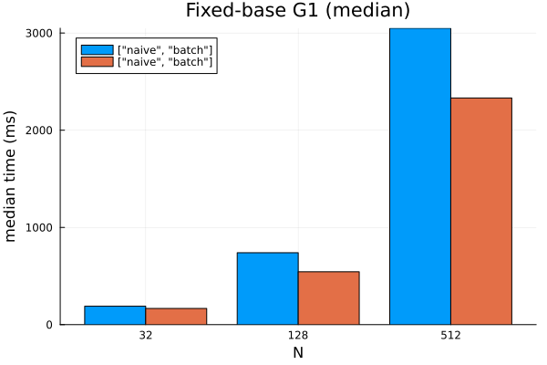
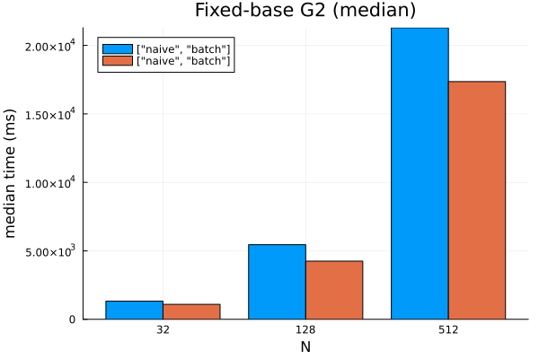
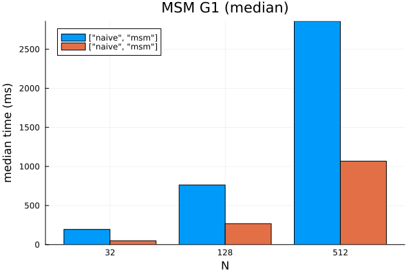
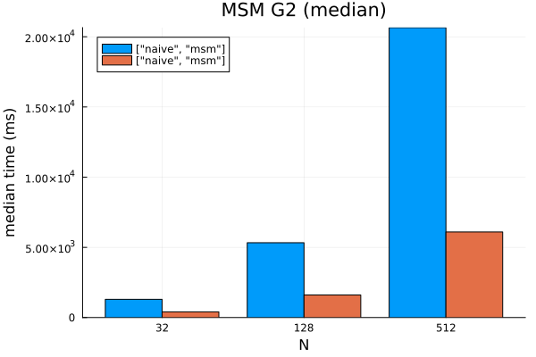
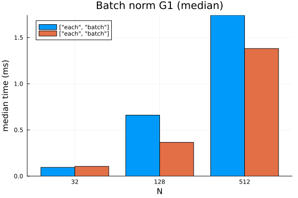
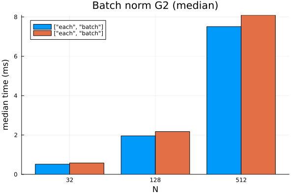
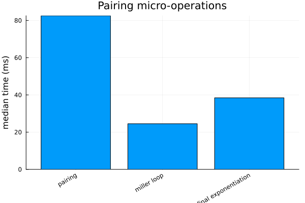
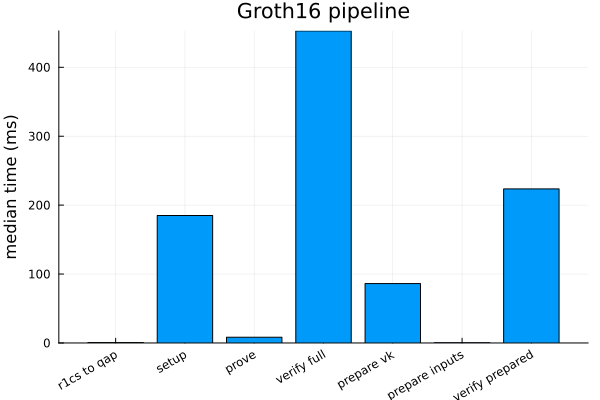

# Benchmarks

This directory contains a self-contained BenchmarkTools environment and two scripts:

- `run.jl` — runs a suite of microbenchmarks and end-to-end timings, saving a JSON summary
- `plot.jl` — reads the latest (or given) JSON and renders comparison plots

## What’s Measured

- Fixed-base precompute (setup hot path)
  - G1/G2 table build time (one-time, per base)
  - `batch_mul` (precomputed) vs `scalar_mul` loop for generating N points
- Variable-base MSM (prover hot path)
  - `multi_scalar_mul` (MSM) vs naive accumulation for N bases/scalars
- Batch normalization
  - `batch_to_affine!` vs per-point `to_affine` for N points, with fresh projective inputs per sample
- Pairing engine
  - Sequential accumulation of N pairings vs `pairing_batch`
  - Breakdown of single pairing into `miller_loop` and `final_exponentiation`
- Groth16 pipeline (sum-of-products example circuit)
  - `r1cs_to_qap`, `setup_full`, `prove_full`, `verify_full`
  - Prepared verifier helpers (`prepare_verifying_key`, `prepare_inputs`, `verify_with_prepared`)

Microbenchmarks run at sizes N ∈ {32, 128, 512}. Results are printed with min/median/mean and memory, and a JSON summary is saved to `benchmarks/results_YYYY-mm-dd_HHMMSS.json`. Each JSON entry records:

- `min_pretty` / `median_pretty`: original `TrialEstimate(...)` strings
- `min_seconds` / `median_seconds`: numeric timings in seconds (for plotting / baselines)
- `memory_bytes`: peak allocation during the trial

`plot.jl` produces the following visual comparisons (all using median timings):

- Microbenchmarks: `fixed_g1.png`, `fixed_g2.png`, `msm_g1.png`, `msm_g2.png`, `norm_g1.png`, `norm_g2.png`
- Pairing comparisons: `pairing.png` (sequential vs batch), `pairing_ops.png` (miller loop / final exponent)
- Groth16 pipeline: `groth16.png`

## Baseline 2025-09-23

- JSON summary: `results_2025-09-23_204214.json`
- Environment details: `results_2025-09-23_204214_env.md`
- Host: AMD Ryzen AI 9 HX 370 (24 threads) on Linux 6.16.7-arch1-1, Julia 1.11.7 (default thread count)

### Plots











| Benchmark | N | naive median (s) | optimised median (s) |
| --- | --- | --- | --- |
| Fixed-base G1 (`scalar_mul` vs `batch_mul`) | 32 | 0.190 | 0.167 |
|  | 128 | 0.740 | 0.544 |
|  | 512 | 3.050 | 2.332 |
| Fixed-base G2 | 32 | 1.325 | 1.094 |
|  | 128 | 5.451 | 4.247 |
|  | 512 | 21.292 | 17.357 |
| Variable-base MSM G1 | 32 | 0.194 | 0.049 |
|  | 128 | 0.763 | 0.268 |
|  | 512 | 2.858 | 1.068 |
| Variable-base MSM G2 | 32 | 1.299 | 0.404 |
|  | 128 | 5.331 | 1.607 |
|  | 512 | 20.656 | 6.096 |

| Batch normalisation | N | per-point median (s) | batch median (s) |
| --- | --- | --- | --- |
| G1 | 32 | 0.000095 | 0.000106 |
|  | 128 | 0.000660 | 0.000366 |
|  | 512 | 0.001741 | 0.001381 |
| G2 | 32 | 0.000517 | 0.000576 |
|  | 128 | 0.001956 | 0.002174 |
|  | 512 | 0.007511 | 0.008093 |

| Pairings | Batch | sequential median (s) | batch median (s) |
| --- | --- | --- | --- |
| Accumulate e(P,Q) | 1 | 0.084 | 0.085 |
|  | 4 | 0.398 | 0.231 |
|  | 16 | 1.560 | 0.695 |
| Single pairing | - | 0.083 | - |
| Miller loop | - | 0.025 | - |
| Final exponentiation | - | 0.038 | - |

| Groth16 pipeline (sum-of-products circuit) | median (s) |
| --- | --- |
| `r1cs_to_qap` | 0.00068 |
| `setup_full` | 0.185 |
| `prove_full` | 0.0083 |
| `verify_full` | 0.453 |
| `prepare_verifying_key` | 0.086 |
| `prepare_inputs` | 0.00037 |
| `verify_with_prepared` | 0.224 |

## Usage

One-time setup from the repo root:

```
julia --project=benchmarks -e '
using Pkg;
Pkg.develop(PackageSpec(path=joinpath(pwd(),"GrothAlgebra")));
Pkg.develop(PackageSpec(path=joinpath(pwd(),"GrothCurves")));
Pkg.develop(PackageSpec(path=joinpath(pwd(),"GrothProofs")));
Pkg.add(["BenchmarkTools","JSON","StatsPlots"]);
Pkg.resolve(); Pkg.instantiate();
'
```

Run benchmarks (prints stats and saves a JSON):

```
julia --project=benchmarks benchmarks/run.jl
```

Render plots for the latest JSON (or pass a specific file):

```
julia --project=benchmarks benchmarks/plot.jl
julia --project=benchmarks benchmarks/plot.jl results_2025-09-10_145900.json
```

## Notes

- BenchmarkTools excludes JIT compilation after the first execution. We also run explicit warmups before timing to avoid first-sample JIT.
- Fixed-base timings are split between table build (one-time cost per base) and `batch_mul` (per vector). In setup we build once and reuse across A/B/C/H/L/IC.
- Consider fixing `JULIA_NUM_THREADS` when comparing runs; record CPU/machine info for fair comparisons.
- JSON now contains numeric fields in seconds for easier downstream processing while keeping the human-readable `TrialEstimate` strings.
