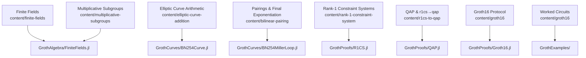

# RareSkills Book → Groth16 Implementation Map

This note stitches together the RareSkills ZK book with the Julia implementations in `Groth.jl`. Use it as a compass while jumping between conceptual chapters and performance-oriented code.

## Algebraic Foundations
- **RareSkills chapters:** `finite-fields`, `multiplicative-subgroups`, `polynomial`, and `inner-product-algebra` build the arithmetic scaffolding. They work with generic prime fields and simple polynomial rings.
- **Julia counterparts:** `GrothAlgebra/FiniteFields.jl` defines `FiniteFieldElement` over BN254 with BigInt-backed reduction tuned for Julia’s LLVM backend, while `Polynomial.jl` mirrors the book’s interpolation and evaluation routines but adds cached structure and batched Horner evaluation. Group operations and WNAF helpers live in `Group.jl`, extending the book’s additive group notes to windowed scalar multiplication.

## Curves, Pairings, and Performance Tweaks
- **RareSkills chapters:** `elliptic-curves-finite-fields`, `elliptic-curve-addition`, and `bilinear-pairing` introduce short Weierstrass formulas, projective coordinates, and the Miller loop/final exponentiation split.
- **Julia counterparts:** `GrothCurves/BN254Curve.jl` implements G1/G2 arithmetic using `SVector`-backed coordinates and hand-tuned mixed addition formulas. The book’s affine demonstrations map here, but we stay in Jacobian projective form to avoid inversions. Pairing pieces (`BN254MillerLoop.jl`, `BN254FinalExp.jl`, `BN254Pairing.jl`) follow the optimal ate sequence and reuse Frobenius shortcuts absent from the pedagogical derivation. The new `BN254Engine` wraps these routines so future curves can slot into the same API.
- **Key takeaway:** while the RareSkills text favors clarity in affine space, the Julia code switches to projective coordinates, batch normalization, and precomputation to keep the prover fast without changing the algebraic contracts.

## Constraint Systems and Polynomial Encodings
- **RareSkills chapters:** `rank-1-constraint-system`, `quadratic-constraints`, `quadratic-arithmetic-program`, and `r1cs-to-qap` show how circuits become matrices, then polynomials, culminating in $\mathcal{A}(x)\cdot\mathcal{B}(x) - \mathcal{C}(x) = Z_H(x) H(x)$.
- **Julia counterparts:** `GrothProofs/R1CS.jl` encodes the constraint matrices and witnesses, while `QAP.jl` performs the $\nabla$-style evaluation and target polynomial construction using vectorised field ops. The helper `compute_h_polynomial` concretely realises the book’s division step and stores coefficients directly in BN254 field elements.

## Groth16 Assembly
- **RareSkills chapter:** `groth16` walks through trusted setup, proving, and verification equations.
- **Julia counterparts:** `GrothProofs/Groth16.jl` wires the algebra into `setup_full`, `prove_full`, and `verify_full`. Verification now routes through the pairing-engine abstraction, batching pairings via `pairing_batch(engine, ...)` to trim Miller loop calls—one of the main departures from the chapter’s scalar presentation.
- **Examples:** `GrothExamples/` mirrors the RareSkills worked circuits (`compute-then-constrain`, `hello-world-circom`) and is the quickest place to line up inputs and transcripts with the book’s walkthroughs.

## Using This Map
1. Start with the RareSkills section you are reviewing.
2. Jump to the matching Julia file listed above for the optimized implementation.
3. Note the structural differences—projective coordinates, batched MSM, or explicit BN254 constants—that keep the semantics identical while fitting high-performance Groth16 proving.

When adding features, update this mapping so future readers can trace ideas from prose to production-grade code.
