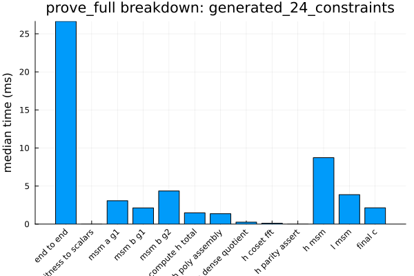
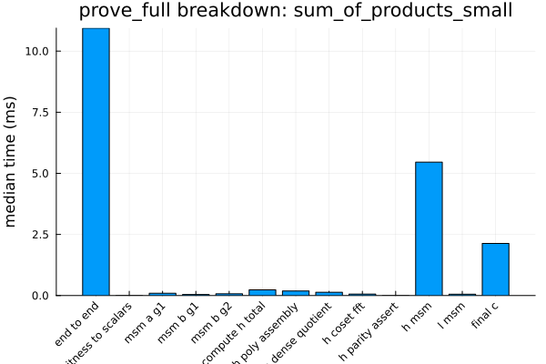

# [Benchmark Snapshots](@id benchmark-snapshots)

This page preserves the longer benchmark notes from recent Groth.jl performance
passes. For the benchmark workflow and external primitive comparisons, see
[Benchmarks](@ref).

```@contents
Pages = ["benchmark-snapshots.md"]
Depth = 2
```

## Stage 8 Snapshot (2026‑04‑01)

The current Stage 8 prover re-baseline artifact is:

- `benchmarks/artifacts/2026-04-01_220953/results/benchmark_results.json`

Relative to the last pre-Stage-8 `prove_full` baseline
(`2026-04-01_174156`), the continuity fixture improved but the primary larger
fixture stayed effectively flat:

- `sum_of_products_small`
  - `prove_full`: `9.219 ms -> 8.248 ms`
  - `final_c`: `4.015 ms -> 2.983 ms`
- `generated_24_constraints`
  - `prove_full`: `30.045 ms -> 30.088 ms`
  - `final_c`: `4.072 ms -> 3.001 ms`
  - `msm_b_g2`: `4.509 ms -> 4.714 ms`
  - `h_msm`: `7.310 ms -> 7.805 ms`
  - `l_msm`: `3.989 ms -> 4.210 ms`

So the backend rewrite clearly reduced final proof assembly cost, but the
current prover baseline says the next real wins still need to come from the
MSM-heavy prover buckets rather than from `final_c`.

## Stage 8A Snapshot (2026‑04‑02)

The Stage 8A scalar-plumbing follow-through artifacts are:

- `benchmarks/artifacts/2026-04-01_223814/results/benchmark_results.json`
- `benchmarks/artifacts/2026-04-01_223859/results/benchmark_results.json`

Stage 8A removed the prover’s hot `BN254Fr -> BigInt` scalar conversions and
then reran the `prove_full` baseline.

On the direct scalar-plumbing comparison for the main deterministic fixture:

- `scalar_mul(delta_g1, r)`: `0.737 ms -> 0.720 ms`
- `scalar_mul(delta_g2, s)`: `2.442 ms -> 2.355 ms`
- `A_query` MSM: `3.019 ms -> 2.937 ms`
- `B_query_g2` MSM: `4.477 ms -> 4.299 ms`
- `H` MSM: `7.198 ms -> 7.128 ms`
- `L` MSM: `3.993 ms -> 3.873 ms`

Relative to the first Stage 8 `prove_full` baseline (`2026-04-01_220953`):

- `generated_24_constraints`
  - `prove_full`: `30.088 ms -> 28.873 ms`
  - `msm_b_g2`: `4.714 ms -> 4.334 ms`
  - `h_msm`: `7.805 ms -> 7.036 ms`
  - `l_msm`: `4.210 ms -> 3.856 ms`
  - `final_c`: `3.001 ms -> 2.804 ms`
- `sum_of_products_small`
  - `prove_full`: `8.248 ms -> 8.614 ms`

The most important profiler result is qualitative as well as quantitative: the
main Stage 8A `prove_full` dump no longer contains `canonical_bigint` or
`limbs_to_bigint`. The prover still creates `BigInt`s elsewhere, but the
measured hot prover scalar-conversion path identified in Stage 8 is now gone.

## QAP Domain, H Quotient, and H/L MSM Snapshot (2026-05-11)

The latest QAP-domain-aligned Stage 8 prover fixture run is:

- tracked summary:
  `docs/src/assets/prove_full_msm_tuning_2026_05_11.json`
- local full artifact:
  `benchmarks/artifacts/2026-05-11_165756/results/benchmark_results.json`

This run uses the arkworks-shaped QAP domain: active constraints first,
public-input selector rows next, and zero padding to the next power of two.
`prove_full` computes H through the coset-only quotient path and now combines
the H and L contributions into one G1 MSM because the `C` proof element only
uses `H + L`. The checked dense/coset helper remains covered by tests. The
fixture setup still proves once and asserts `verify_full` before timing.

- `sum_of_products_small`
  - constraints/public/domain: `3 / 6 / 16`
  - `prove_full`: `10.943 ms`
  - `compute_h_total`: `0.234 ms`
  - `h_msm`: `5.458 ms`
  - `l_msm`: `0.055 ms`
  - `h_l_msm`: `5.619 ms`
  - `final_c`: `2.133 ms`
- `generated_24_constraints`
  - constraints/public/domain: `24 / 8 / 32`
  - `prove_full`: `26.643 ms`
  - `compute_h_total`: `1.481 ms`
  - `h_msm`: `8.726 ms`
  - `l_msm`: `3.871 ms`
  - `h_l_msm`: `11.029 ms`
  - `final_c`: `2.140 ms`

The generated fixture MSM selections recorded in the tracked summary are:

| Query | Size | Selected backend |
| --- | ---: | --- |
| A query G1 | `28` | `pippenger_w3` |
| A/B1 fused G1 | `28` | `pippenger_pair_w2` |
| B query G2 | `28` | `pippenger_w2` |
| H query G1 | `31` | `pippenger_w3` |
| L query G1 | `20` | `pippenger_w3` |
| H+L query G1 | `51` | `pippenger_w5` |

| Generated fixture | Small fixture |
| --- | --- |
|  |  |

Interpretation: the small fixture intentionally gets a larger domain because
`3 constraints + 6 public` rounds up to `16`, so it is no longer directly
comparable to the old constraint-only domain timing. The larger fixture already
rounds to `32`, so it remains the better continuity fixture for prover-shaped
tuning. Relative to the previous coset-only H baseline `2026-05-11_133047`, the
generated fixture improved `prove_full` by `6.96%` and `final_c` by `5.14%`.

## Setup Query Generation Snapshot (2026-05-11)

The setup-focused artifact is:

- tracked summary:
  `docs/src/assets/setup_full_tuning_2026_05_11.json`
- local full artifact:
  `benchmarks/artifacts/2026-05-11_175228/results/benchmark_results.json`

The setup profile times `setup_full` on the same deterministic fixtures used by
the prover benchmark. It proves and verifies once per fixture before timing, so
the measured keys are checked for end-to-end Groth16 usability.

| Fixture | Domain | Baseline median | Current median | Change |
| --- | ---: | ---: | ---: | ---: |
| `sum_of_products_small` | `16` | `47.910 ms` | `46.007 ms` | `-3.97%` |
| `generated_24_constraints` | `32` | `142.715 ms` | `116.918 ms` | `-18.08%` |

Interpretation: the setup sweep showed that G1 fixed-base w-NAF is not the best
choice for the full-width setup scalars in these fixtures. `setup_full` now
uses the BN254 G1 scalar dispatcher, whose GLV path is faster for those scalars,
while the G2 query uses a wider fixed-window batch path. The generated fixture
is again the better continuity signal because it exercises a larger set of
query scalars.

## Safe G2 Subgroup GLV Snapshot (2026-05-11)

The safe G2 GLV exposure artifact is:

- tracked summary:
  `docs/src/assets/g2_subgroup_glv_tuning_2026_05_11.json`
- local full artifact:
  `benchmarks/artifacts/2026-05-11_190310/results/benchmark_results.json`

This run keeps generic G2 `scalar_mul` on the arbitrary-point w-NAF path and
measures the explicit subgroup-only GLV helper separately. Groth16 setup/proving
use the helper only for G2 key points whose subgroup ownership follows from
construction.

| Scalar bits | G2 default | G2 w-NAF | G2 subgroup GLV |
| --- | ---: | ---: | ---: |
| `32` | `0.335 ms` | `0.314 ms` | `0.335 ms` |
| `64` | `0.525 ms` | `0.530 ms` | `0.554 ms` |
| `128` | `1.014 ms` | `1.072 ms` | `1.504 ms` |
| `192` | `1.544 ms` | `1.632 ms` | `1.609 ms` |
| `254` | `2.455 ms` | `2.440 ms` | `1.612 ms` |

Interpretation: the explicit G2 GLV path is not a universal scalar-mul default;
it is useful for the full-width subgroup-owned scalars used by setup/proving.
The `scalar_plumbing` fixture reported `g2_subgroup_scalar_mul(delta_g2, s)` at
`1.549 ms` for `BN254Fr`, versus `2.355 ms` for the earlier generic G2 scalar
path in the Stage 8A notes. Verifier subgroup checks still use generic G2 scalar
multiplication because proof inputs are untrusted.

## G1 GLV-MSM Prover Snapshot (2026-05-11)

The G1 GLV-MSM prover artifact is:

- tracked summary:
  `docs/src/assets/g1_glv_msm_tuning_2026_05_11.json`
- local full artifact:
  `benchmarks/artifacts/2026-05-11_193033/results/benchmark_results.json`

This run routes only the combined H/L G1 prover MSM through explicit BN254 G1
GLV decomposition. The A/B1 fused query MSM was checked separately and did not
improve, so it remains on the existing fused pair MSM path.

| Fixture | Generic H/L MSM | G1 GLV H/L MSM | Phase change | `prove_full` |
| --- | ---: | ---: | ---: | ---: |
| `sum_of_products_small` | `6.642 ms` | `4.924 ms` | `-25.87%` | `11.594 ms` |
| `generated_24_constraints` | `11.907 ms` | `9.647 ms` | `-18.98%` | `27.626 ms` |

For the generated fixture, the H/L query has `51` original bases and expands to
`90` GLV terms with maximum component width `127` bits. Interpretation: the
MSM phase improvement is clear, but end-to-end proving is essentially flat
relative to the preceding same-day run (`27.659 ms -> 27.626 ms`).

## Limb-Native GLV Decomposition Snapshot (2026-05-11)

- Focused run:
  `artifacts/2026-05-11_195230/results/benchmark_results.json`
- Tracked summary:
  `docs/src/assets/limb_native_glv_decomposition_2026_05_11.json`

This pass keeps the same GLV lattice decomposition semantics, but routes
`BN254Fr` scalars through fixed-width `UInt256`/`UInt512`/`Int256` arithmetic
instead of decoding to `BigInt`. The generic `Integer` GLV path remains
`BigInt`-based for external callers. Tests compare the new `BN254Fr`
decomposition against the previous BigInt decomposition and re-check
`k == k1 + lambda*k2 mod r` for G1 and G2.

Scalar-plumbing medians on the generated fixture:

| Workload | BigInt | BN254Fr limb-native | Change |
| --- | ---: | ---: | ---: |
| `g1_scalar_delta` | `0.855 ms` | `0.804 ms` | `-5.98%` |
| `g2_subgroup_delta` | `1.734 ms` | `1.689 ms` | `-2.60%` |
| `A_query` MSM | `3.508 ms` | `3.357 ms` | `-4.30%` |
| `B2_query` MSM | `4.826 ms` | `4.704 ms` | `-2.53%` |
| `H` MSM | `9.893 ms` | `9.257 ms` | `-6.43%` |
| `L` MSM | `4.289 ms` | `4.137 ms` | `-3.54%` |

Prover fixture summary:

| Fixture | Generic H/L MSM | Limb-native GLV H/L MSM | Phase change | `prove_full` |
| --- | ---: | ---: | ---: | ---: |
| `sum_of_products_small` | `5.871 ms` | `4.717 ms` | `-19.65%` | `10.024 ms` |
| `generated_24_constraints` | `12.464 ms` | `9.538 ms` | `-23.48%` | `26.606 ms` |

For the generated fixture, the H/L GLV phase moved from `9.647 ms` in the prior
G1 GLV-MSM artifact to `9.538 ms` here (`-1.13%`). End-to-end `prove_full`
moved from `27.626 ms` to `26.606 ms` (`-3.69%`), but the safer reading is that
limb-native decomposition trims plumbing overhead without changing the broader
prover performance picture.

## Final Exponentiation / GT Snapshot (2026-05-11)

- Baseline run:
  `artifacts/2026-05-11_212628/results/benchmark_results.json`
- Current run:
  `artifacts/2026-05-11_212945/results/benchmark_results.json`
- Tracked summary:
  `docs/src/assets/final_exp_gt_specialization_2026_05_11.json`

This pass keeps the generic `exp_by_u(::Fp12Element)` available for arbitrary
`Fp12` values, but adds an explicit `cyclotomic_exp_by_u` helper for values
already known to be in GT/cyclotomic form. The final exponentiation hard part
uses that helper only after `final_exponentiation_easy` has established the
cyclotomic subgroup condition. The existing cyclotomic square formula was also
tightened to use field additions for doubling/tripling instead of integer
scalar multiplication.

| Workload | Baseline | Current | Change |
| --- | ---: | ---: | ---: |
| Single pairing | `3.135 ms` | `2.835 ms` | `-9.57%` |
| Final exponentiation | `1.270 ms` | `0.939 ms` | `-26.03%` |
| Final exponentiation hard part | `1.301 ms` | `0.930 ms` | `-28.51%` |
| Generic `exp_by_u` | `0.379 ms` | `0.385 ms` | `+1.61%` |
| Cyclotomic `u` exponent | - | `0.243 ms` | `-36.90%` vs current generic |

Validation compares `cyclotomic_square(m)` against generic `square(m)`,
`cyclotomic_exp_by_u(m)` against `exp_by_u(m)`, and a second `u` exponent
against `cyclotomic_exp(m, BN254_U^2)` for deterministic easy-part pairing
outputs. Pairing bilinearity and Groth16 verification tests pass unchanged.

## Latest Snapshot (2025‑09‑29)

```@example
using JSON
json_path = joinpath(@__DIR__, "assets", "results_2025-09-29_121914.json")
results = JSON.parsefile(json_path)
keys(results)
```

Each entry contains per-benchmark medians, deviations, and configuration
metadata (threading, window sizes, curve parameters). Refer to
`benchmarks/results_2025-09-23_204214_env.md` for the environment capture that
accompanied the latest run.

## Plots


