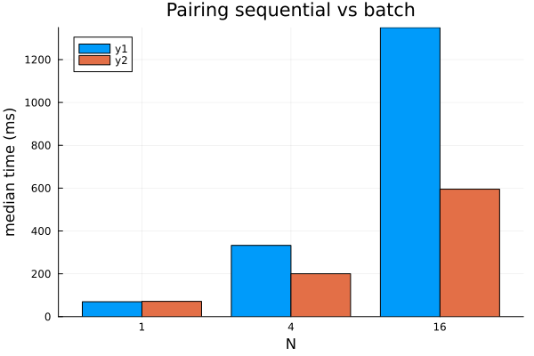
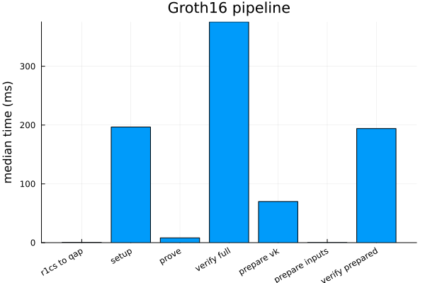
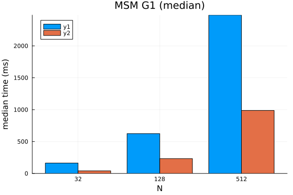

# Benchmarks

The `benchmarks/` project captures runtime and throughput measurements for the
hottest Groth16 paths. This page summarises how to regenerate the data and shows
the latest artefacts.

## Running the Suite

1. Instantiate the root workspace:

   ```bash
   julia --project=. -e 'using Pkg; Pkg.instantiate(workspace=true)'
   ```

2. Run the benchmark harness (artifacts land under `benchmarks/artifacts/<run_id>/`):

   ```bash
   julia --project=. benchmarks/run.jl
   ```

   For a faster developer loop during primitive/backend work, use a filtered
   profile or an explicit group list:

   ```bash
   julia --project=. benchmarks/run.jl --list-profiles
   julia --project=. benchmarks/run.jl --profile=quick
   julia --project=. benchmarks/run.jl --profile=stage3
   julia --project=. benchmarks/run.jl --profile=stage5
   julia --project=. benchmarks/run.jl --profile=stage7a
   julia --project=. benchmarks/run.jl --groups=bn254_primitives,bn254_polynomials,pairing_micro
   julia --project=. benchmarks/run.jl --groups=bn254_curve_kernels,batch_norm
   julia --project=. benchmarks/run.jl --groups=glv_scalar_tuning
   ```

3. Regenerate plots (latest run by default, or pass a run id / JSON file):

   ```bash
   julia --project=. benchmarks/plot.jl
   julia --project=. benchmarks/plot.jl 2026-03-05_144036
   ```

4. Compare two snapshots and flag regressions (20% threshold by default):

   ```bash
   julia --project=. benchmarks/compare.jl 2026-03-05_144036 2026-03-06_091500
   julia --project=. benchmarks/compare.jl 2025-09-29_121914 2026-03-05_144036 10
   ```

5. Profile the `prove_full` path on the deterministic benchmark fixtures:

   ```bash
   julia --project=. benchmarks/profile_prove_full.jl
   julia --project=. benchmarks/profile_prove_full.jl --run-id=2026-03-05_144036 --fixture=sum_of_products_small --repetitions=75
   ```

6. Generate a one-shot markdown report (run -> plot -> compare latest-1 vs latest):

   ```bash
   julia --project=. benchmarks/report.jl
   julia --project=. benchmarks/report.jl --skip-run --threshold=10
   ```

The harness writes a timestamped JSON (raw statistics) and PNG charts covering
direct BN254 field and tower primitives, direct G1/G2 add-double-affine kernels,
BN254 `Fr` polynomial/domain helpers, scalar multiplication, the Stage 7A GLV
scalar sweep, MSM, pairing,
normalisation, Groth16 end-to-end timings, and `prove_full` fixture
breakdowns.
The profiling script writes text profiler dumps under the same artifact tree,
but profiling remains a separate workflow from reproducible timing baselines.

When the workspace also includes a sibling `py_ecc/` checkout and `python3` is
available, the benchmark run additionally records matched BN254 primitive
comparisons against `py_ecc` for G1/G2 scalar multiplication, naive
variable-base accumulation, and a single pairing. These are primitive-only
comparisons; they are not end-to-end Groth16 prover comparisons.

The benchmark artifact also contains a `_semantic` section with deterministic
serialized outputs for the BN254 primitive fixtures and direct curve-kernel
fixtures. Those records are not plotted, but they are kept so future backend
migrations can compare exact results alongside timing data. The `_meta` section
records whether the run was the default full suite or a filtered benchmark
profile.

## Latest Snapshot (2025‑09‑29)

```@example
using JSON
json_path = joinpath(@__DIR__, "assets", "results_2025-09-29_121914.json")
results = JSON.parsefile(json_path)
keys(results)
```

Each entry contains per-benchmark medians, deviations, and configuration
metadata (threading, window sizes, curve parameters). Refer to
`benchmarks/results_2025-09-23_204214_env.md` for the environment capture that
accompanied the latest run.

## Plots






