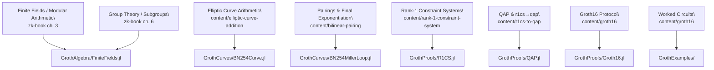

# [RareSkills / zk-book ↔ Groth.jl Map](@id rareskills-map)

This page stitches together the local `zk-book/` checkout, the RareSkills
Groth16 material, and the production implementations inside Groth.jl. Use it as
a compass when moving from conceptual chapters to code.

```@contents
Pages = ["rareskills-map.md"]
Depth = 2
```



## Algebraic Foundations

- **zk-book / RareSkills concepts:** finite fields and modular arithmetic,
  group theory, homomorphisms, multiplicative subgroups, polynomial arithmetic,
  and inner-product algebra.
- **Groth.jl counterparts:**
  - `GrothAlgebra/FiniteFields.jl` defines `FiniteFieldElement` plus the
    current fixed-width Montgomery BN254 field backend.
  - `GrothAlgebra/Polynomial.jl` implements Horner evaluation, interpolation, derivatives, and FFT scaffolding.
  - `GrothAlgebra/Group.jl` provides curve-agnostic group operations, w-NAF helpers, and MSM support.
- **What changes in code:** we lean on fixed-width limbs, concrete extension-field
  storage, windowed MSM, and FFT-friendly evaluation domains to feed the prover
  efficiently.

## Curves, Towers, and Pairings

- **zk-book / RareSkills concepts:** elliptic curve addition, elliptic curves
  over finite fields, bilinear pairings, Miller loops, and final
  exponentiation.
- **Groth.jl counterparts:**
  - `GrothCurves/BN254Curve.jl` keeps G1/G2 in Jacobian form with mixed additions and batch normalisation.
  - Tower files (`BN254Fp2.jl`, `BN254Fp6_3over2.jl`, `BN254Fp12_2over6.jl`) encode the extension fields exactly as derived in the book.
  - `BN254MillerLoop.jl`, `BN254FinalExp.jl`, `BN254Pairing.jl` follow the optimal ate pipeline and reuse Frobenius shortcuts.
- **What changes in code:** we use sparse Fp12 placement, precomputed Frobenius constants, and the `BN254Engine` abstraction so future curves can reuse the same interface.

## Constraint Systems and QAPs

- **zk-book / RareSkills concepts:** arithmetic circuits, rank-1 constraint
  systems, Lagrange interpolation, Schwartz-Zippel, quadratic arithmetic
  programs, and R1CS to QAP.
- **Groth.jl counterparts:**
  - `GrothProofs/R1CS.jl` ships multiplication, sum-of-products, affine-product, and square-offset circuits plus randomised fixtures.
  - `GrothProofs/QAP.jl` records the active constraint points and builds an arkworks-shaped power-of-two domain: constraint rows first, public-input selector rows next, and zero padding last.
- **What changes in code:** `prove_full` uses the coset-only quotient path, while
  dense/coset parity survives in tests and debugging helpers. The current
  performance work is focused more on prover hot paths than on broad domain
  rewrites.

## Groth16 Pipeline

- **zk-book / RareSkills concepts:** trusted setup, evaluating a QAP on a
  trusted setup, and Groth16 proving and verification.
- **Groth.jl counterparts:**
  - `GrothProofs/Groth16.jl` wires setup/prove/verify, including the prepared verifier path and batched pairings via `pairing_batch`.
  - `GrothProofs/test/runtests.jl` mirrors the book’s witness discipline across multiple circuit families.
  - `GrothExamples/` provides notebook-based walkthroughs (AbstractAlgebra-first
    and Groth package-native R1CS → QAP flows) for side-by-side comparison.

## How to Use the Map

1. Start with the `zk-book` / RareSkills section you are studying.
2. Jump to the matching Groth.jl module listed above.
3. Compare representation choices—projective vs affine, batched MSM, FFT preparation—to understand how the production prover keeps the algebraic guarantees while optimising for performance.

Update this page whenever new features land or the textbook mapping shifts.
