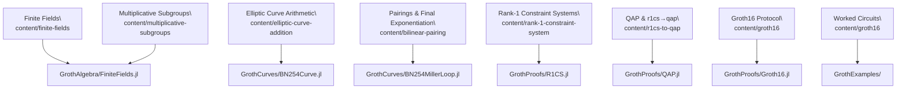

# [RareSkills ↔ Groth.jl Map](@id rareskills-map)

This page stitches together the RareSkills Groth16 book with the production
implementations inside Groth.jl. Use it as a compass when moving from
conceptual chapters to code.

```@contents
Pages = ["rareskills-map.md"]
Depth = 2
```



## Algebraic Foundations

- **RareSkills chapters:** `finite-fields`, `multiplicative-subgroups`, `polynomial`, `inner-product-algebra`.
- **Groth.jl counterparts:**
  - `GrothAlgebra/FiniteFields.jl` defines `FiniteFieldElement` plus the
    current fixed-width Montgomery BN254 field backend.
  - `GrothAlgebra/Polynomial.jl` implements Horner evaluation, interpolation, derivatives, and FFT scaffolding.
  - `GrothAlgebra/Group.jl` provides curve-agnostic group operations, w-NAF helpers, and MSM support.
- **What changes in code:** we lean on fixed-width limbs, concrete extension-field
  storage, windowed MSM, and FFT-friendly evaluation domains to feed the prover
  efficiently.

## Curves, Towers, and Pairings

- **RareSkills chapters:** `elliptic-curve-addition`, `elliptic-curves-finite-fields`, `bilinear-pairing`.
- **Groth.jl counterparts:**
  - `GrothCurves/BN254Curve.jl` keeps G1/G2 in Jacobian form with mixed additions and batch normalisation.
  - Tower files (`BN254Fp2.jl`, `BN254Fp6_3over2.jl`, `BN254Fp12_2over6.jl`) encode the extension fields exactly as derived in the book.
  - `BN254MillerLoop.jl`, `BN254FinalExp.jl`, `BN254Pairing.jl` follow the optimal ate pipeline and reuse Frobenius shortcuts.
- **What changes in code:** we use sparse Fp12 placement, precomputed Frobenius constants, and the `BN254Engine` abstraction so future curves can reuse the same interface.

## Constraint Systems and QAPs

- **RareSkills chapters:** `rank-1-constraint-system`, `quadratic-arithmetic-program`, `r1cs-to-qap`.
- **Groth.jl counterparts:**
  - `GrothProofs/R1CS.jl` ships multiplication, sum-of-products, affine-product, and square-offset circuits plus randomised fixtures.
  - `GrothProofs/QAP.jl` records constraint points, constructs power-of-two domains, and currently recovers coefficients via barycentric interpolation before padding for the coset FFT.
- **What changes in code:** the prover defaults to the coset quotient path, and
  the dense path survives only as a parity assertion. The current performance
  work is now focused more on prover hot paths than on broad domain rewrites.

## Groth16 Pipeline

- **RareSkills chapter:** `groth16` walks through trusted setup, proving, and verification.
- **Groth.jl counterparts:**
  - `GrothProofs/Groth16.jl` wires setup/prove/verify, including the prepared verifier path and batched pairings via `pairing_batch`.
  - `GrothProofs/test/runtests.jl` mirrors the book’s witness discipline across multiple circuit families.
  - `GrothExamples/` provides notebook-based walkthroughs (AbstractAlgebra-first
    and Groth package-native R1CS → QAP flows) for side-by-side comparison.

## How to Use the Map

1. Start with the RareSkills section you are studying.
2. Jump to the matching Groth.jl module listed above.
3. Compare representation choices—projective vs affine, batched MSM, FFT preparation—to understand how the production prover keeps the algebraic guarantees while optimising for performance.

Update this page whenever new features land or the textbook mapping shifts.
